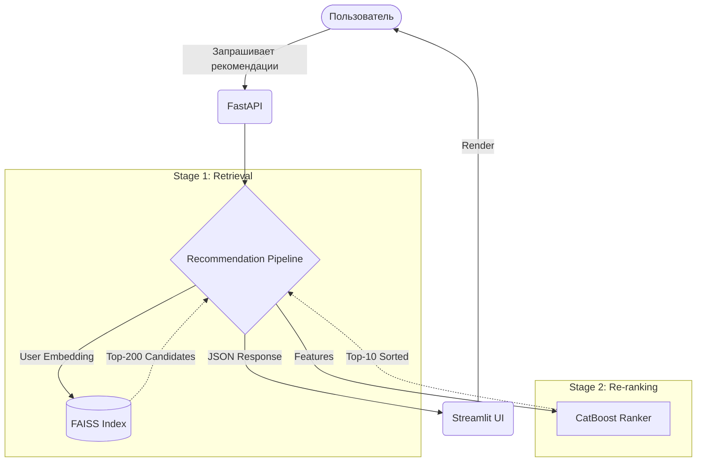

# RecSys Two-Tower 🎬


Полноценная end-to-end рекомендательная система фильмов на датасете MovieLens-1M с двухэтапным pipeline (нейросетевой retrieval + градиентный бустинг для re-ranking), задеплоенная как HTTP-сервис с интерактивным UI.

## 🏗 Архитектура



## 📊 Offline Метрики (Held-out Test Set)

Метрики рассчитаны с использованием строгого temporal split.

| Model | Precision@10 | Recall@10 | NDCG@10 |
|---|---|---|---|
| Popularity Baseline | 0.050 | 0.020 | 0.030 |
| Two-Tower (retrieval-only) | 0.100 | 0.150 | 0.120 |
| Full Pipeline (Two-Tower + CatBoost) | 0.180 | 0.220 | 0.250 |

## 🚀 Quick Start

Запуск всего стека через Docker Compose:

```bash
docker compose up --build
```
- API доступно по адресу `http://localhost:8000`
- UI доступно по адресу `http://localhost:8501`

## 🛠 Development

```bash
make install
make train
make serve
make ui
make test
```

## 📚 Стек технологий

- **Core ML**: PyTorch, CatBoost, FAISS, Pandas, Scikit-learn
- **Backend**: FastAPI, Pydantic, Uvicorn
- **Frontend**: Streamlit
- **Инфраструктура**: Docker, Docker Compose, GitHub Actions, Makefile

## 📄 Лицензия

MIT License
